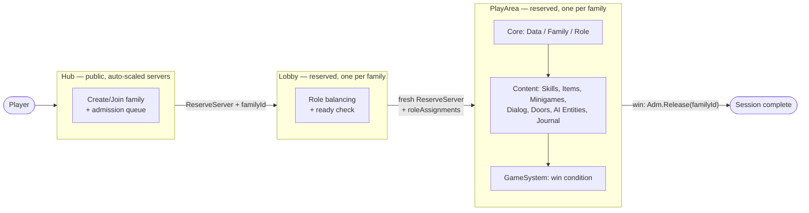

# Diagram — Whole-System Overview (Figure 0)

A single-glance version of the full player journey, at a coarser zoom than
every other diagram in this set — the major system categories, not every
leaf System. Use this as the opener before drilling into
[place topology](01-place-topology.md), [component structure](03-component-structure.md),
or [data flow](04-data-flow.md).

Every box here expands into its own diagram elsewhere in this set:
`HubFlow` → Fig. 03/06, `LobbyFlow` → Fig. 04/07, `Core`/`Content`/`Win` →
Fig. 05/08.
