# Diagram — Place Topology

Referenced from [`ARCHITECTURE.md` §2](../ARCHITECTURE.md#2-place-topology).

Hub (public, auto-scaled) → Lobby (reserved, one per family) → PlayArea
(reserved, one per family). Each place-to-place hop mints its own fresh
`TeleportService:ReserveServer` reservation — a reserved-server access code
is scoped to the specific `placeId` it was reserved against, so it can't be
carried from Lobby into PlayArea. `familyId` (an app-level identifier, not
a Roblox one) is what actually threads a family's identity across all
three legs.

```mermaid
flowchart LR
    subgraph HubPlace["Hub place — public, auto-scaled servers"]
        H1["Title screen:\nCreate Server / Join Server"]
        H2["MatchmakingSystem\n(invite-code grouping)"]
        H3["SessionAdmissionSystem\n(race-safe concurrency gate)"]
        H1 --> H2 --> H3
    end

    subgraph LobbyPlace["Lobby place — reserved server, one per family"]
        L1["FamilyRosterSystem"]
        L2["RoleBalancingSystem\n(5-role auto-balance)"]
        L3["ReadyCheckSystem"]
        L1 --> L2 --> L3
    end

    subgraph PlayAreaPlace["PlayArea place — reserved server, one per family"]
        P1["Amphiteater\n(spawn / staging area)"]
        P2["Outside game\n(Hall of Mirrors, Parkour, Anter Game)"]
        P3["Minigame\n(PIN, sliding puzzle, trivia, ...)"]
        P4["Item / Dialog / Door-Lock / Entity AI\nsystems"]
        P1 --> P2
        P1 --> P3
        P1 --> P4
    end

    H3 -- "TeleportService:ReserveServer(LobbyPlaceId)\n+ familyId in TeleportData" --> LobbyPlace
    L3 -- "fresh ReserveServer(PlayAreaPlaceId)\n+ familyId + roleAssignments" --> PlayAreaPlace
```

**One-time setup (Studio / Creator Dashboard, not a repo/CLI step):** create
a multi-place Universe, add Hub/Lobby/PlayArea as three Places under it,
then fill in `LOBBY_PLACE_ID` / `PLAYAREA_PLACE_ID` in
`Hub/Server/Systems/MatchmakingSystem` and
`Lobby/Server/Systems/ReadyCheckSystem` (both `0` by default).
