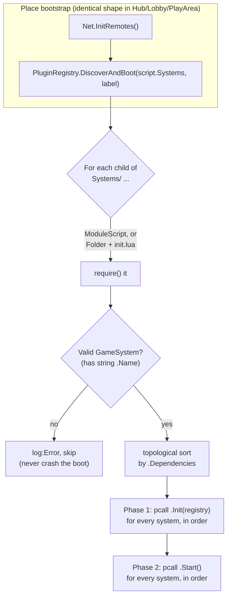

# Diagram — Loose Coupling: PluginRegistry Boot Flow

Referenced from [`ARCHITECTURE.md` §3](../ARCHITECTURE.md#3-loose-coupling-pluginregistry-and-contentregistry).

Every place's bootstrap (`Hub`, `Lobby`, `PlayArea` — server and client
alike) is the same two calls: `Net.InitRemotes()` then
`PluginRegistry.DiscoverAndBoot(script.Systems, label)`. Adding a system is
dropping a folder under `Systems/`; nobody edits a shared bootstrap file.

Each system's `Init`/`Start` is individually `pcall`'d — one system's bug
degrades that system, it doesn't take the whole server down mid-event.
Missing dependencies and dependency cycles are **warned, never fatal**.

`ContentRegistry.Load(container, label)` is the sibling mechanism one
level down, for content plugins (a specific item/skill/minigame/AI
entity/dialog tree) that have no lifecycle of their own — just a unique
`.Id`, looked up on demand by whichever System owns that category.
