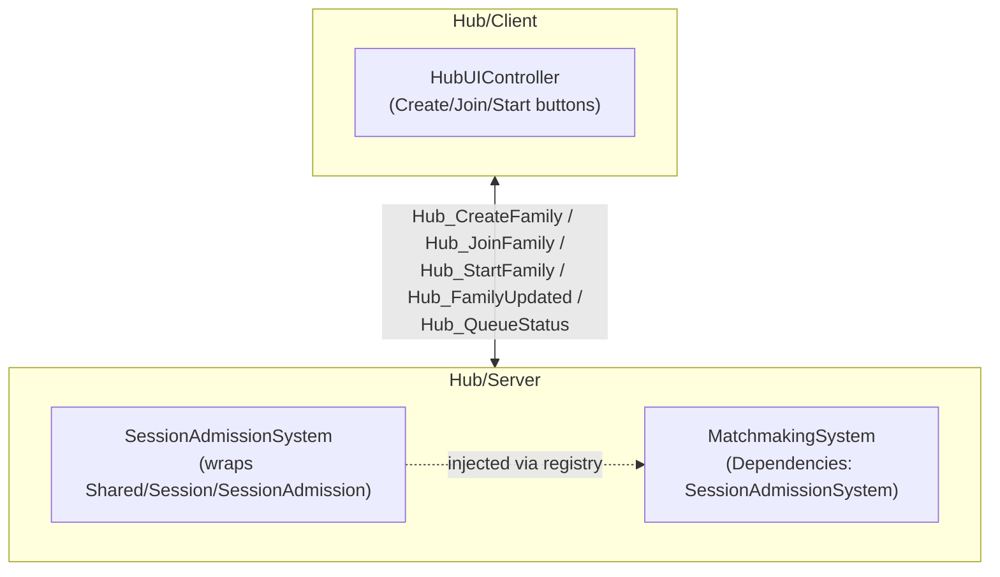
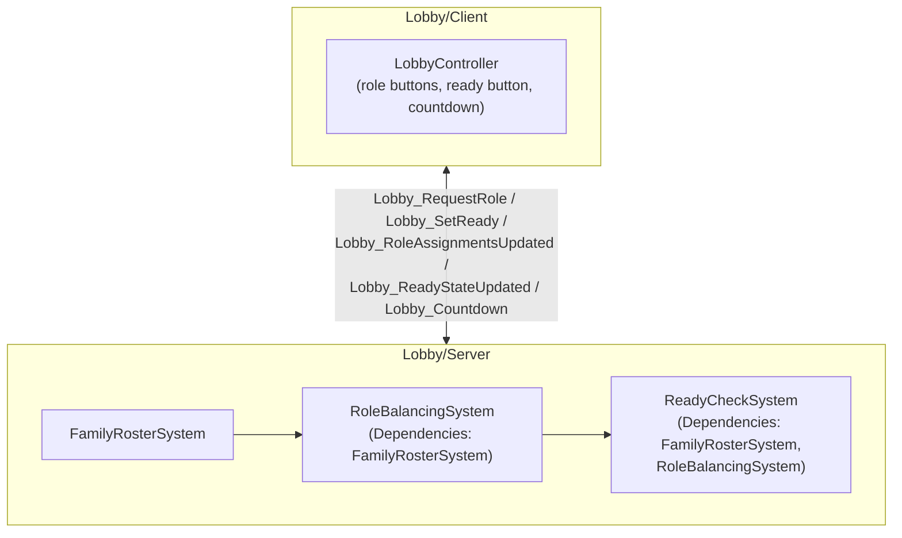
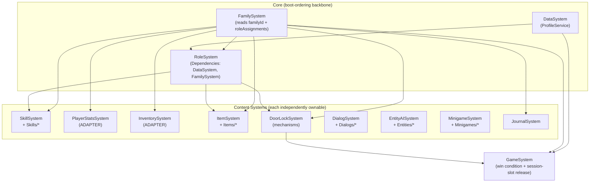

# Diagram — Component Structure (UML)

Referenced from [`ARCHITECTURE.md` §4](../ARCHITECTURE.md#4-component-structure).

The authoritative version of these diagrams is **UML** (pages 11–13 of
[`drawio/jatinangor-architecture.drawio`](drawio/jatinangor-architecture.drawio)):
each System is a `«component»`, grouped into UML packages (folder shapes),
with `«use»` dependency arrows drawn from the declared `.Dependencies` list
in the actual code — nothing here is aspirational, it's read directly off
`Systems/*/init.lua`. Open the `.drawio` file at
<https://app.diagrams.net> (File → Open From → Device) to view/edit pages
11, 12, 13.

The quick-reference flowchart versions below (same information, informal
notation) are kept for a fast read without opening draw.io.

## Hub place

## Lobby place

## PlayArea place

Client mirrors this 1:1 via `PlayArea/Client/Controllers/`:
`RoleController`, `SkillController`, `PlayerStatsController`,
`InventoryController`, `InteractionController` (mechanisms + items, one
Controller since both are "ProximityPrompt → request → server-pushed
update"), `MinigameController`, `DialogController`, `JournalController`,
`UIController` (wires everything to actual UI + applies
`Platform.GetRecommendedUIScale()`).
