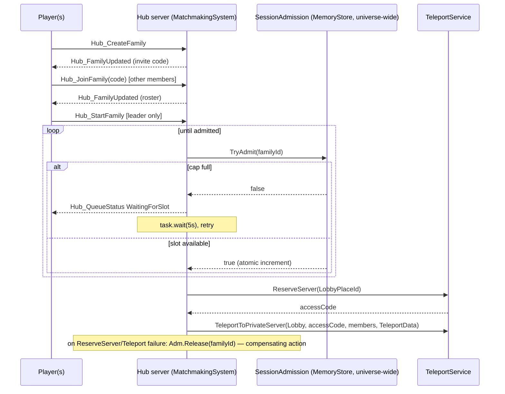
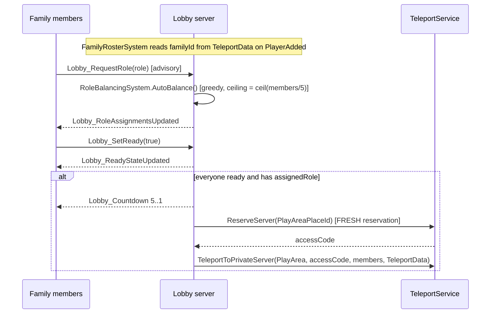
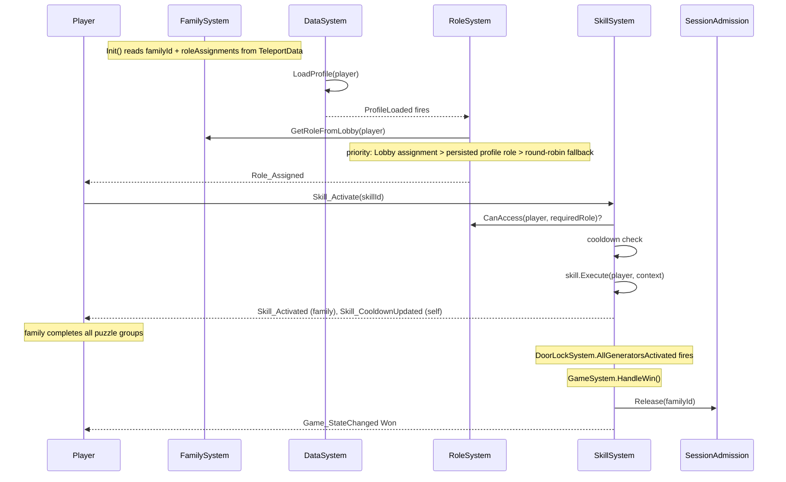
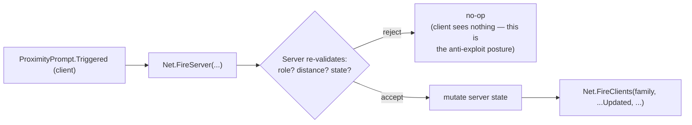

# Diagram — Data Flow Walkthroughs

Referenced from [`ARCHITECTURE.md` §6](../ARCHITECTURE.md#6-data-flow-walkthroughs).

## Hub: create/join a family, get admitted, teleport to Lobby

## Lobby: role balancing → ready check → teleport to PlayArea

## PlayArea: role seeding, a skill activation, and win

## Item / mechanism / minigame / dialog interaction (shared shape)

All four follow the same server-authoritative shape: client requests via
`Net.FireServer`, server re-validates (role, distance, ownership/state),
mutates state, and pushes the update back — the client never renders a
state change it computed itself.

