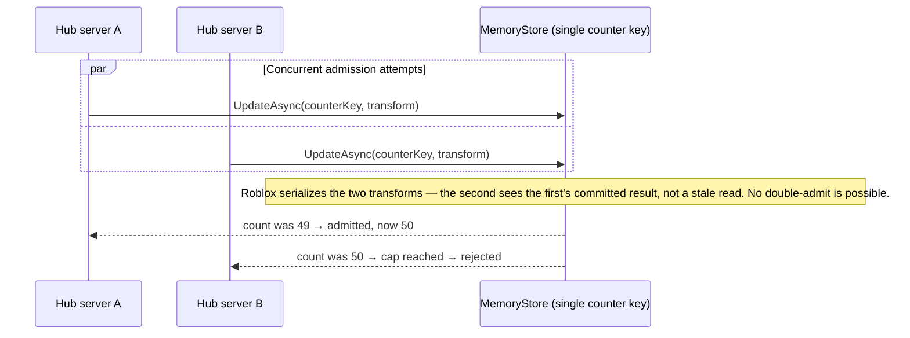

# Diagram — Session Admission Race Condition

Referenced from [`ARCHITECTURE.md` §8.3](../ARCHITECTURE.md#83-the-race-condition-and-why-the-fix-is-correct).

Hub servers are independent Lua VMs with no shared memory. A naive "read
the current count, compare to the cap, write count+1" is a classic
check-then-act race: two Hub servers can both read `count = 49` and both
admit a family, blowing past the cap. The fix collapses the check and the
increment onto **one shared MemoryStore counter key**, inside a single
atomic `UpdateAsync` call — not by scanning per-family entries (that
approach is *not* race-free; MemoryStore's atomicity guarantee is
per-key, so two concurrent admits for two *different* families can each
read a stale total via a separate snapshot read before either commits).

**Release** happens explicitly (never relies on MemoryStore TTL expiry,
which is silent and can't decrement a separate counter): the Hub on a
failed `ReserveServer`/`Teleport` (compensating action), `GameSystem.HandleWin`
on a genuine win, and best-effort in `game:BindToClose` for every other
shutdown path. The one documented gap: a PlayArea server hard-crashing
before `BindToClose` completes leaks that family's slot until a periodic
reconciliation job corrects the drift — flagged as a v1.1 item, not solved
in this baseline.
